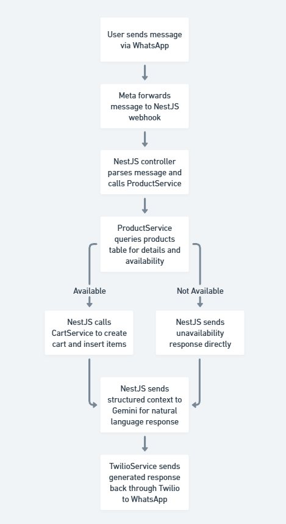
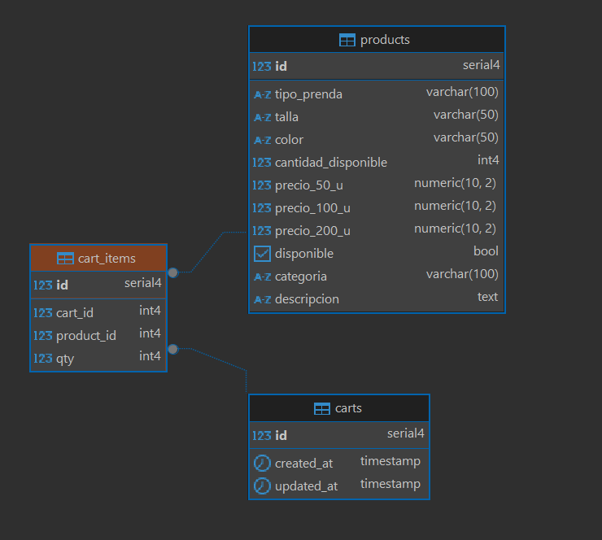
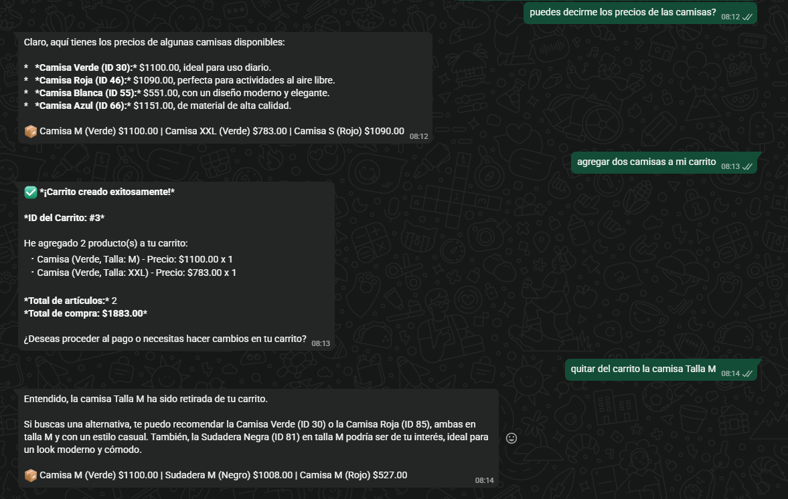

# LabShop - E-Commerce REST API


## 📋 Description

**LabShop** is a complete REST API for an e-commerce clothing store, built with **NestJS** and **TypeScript**. The application includes advanced features such as product management, shopping cart, AI integration (Google Gemini), and WhatsApp communication (Twilio).

## 🎯 Main Features

### 1. **Product Management**
- Complete CRUD for products
- Advanced search by garment type, category, color, and description
- Filtering by queries (query parameters)
- Data validation with DTOs

### 2. **Shopping Cart**
- Create carts with multiple items
- Validation of positive quantities
- Product relations
- Automatic total calculation
- Cart item management

### 3. **Google Gemini AI Integration**
- Text generation via AI
- Intelligent product search
- Automatic recommendations
- Natural language processing

### 4. **WhatsApp Integration (Twilio)**
- Send messages via WhatsApp
- Order notifications
- Purchase confirmations
- Automated customer support

### 5. **Database**
- PostgreSQL as the main database
- TypeORM for object-relational mapping
- Table relationships (1:N, N:M)
- Automatic migrations

## 🏗️ Project Architecture

```
src/
├── main.ts                    # Application entry point
├── app.module.ts              # Main module
├── app.controller.ts          # Main controller
├── app.service.ts             # Main service
│
├── entities/                  # Database entities
│   ├── product.entity.ts      # Product entity
│   ├── cart.entity.ts         # Cart entity
│   └── cart-item.entity.ts    # Cart items entity
│
├── products/                  # Products module
│   ├── products.controller.ts
│   ├── products.service.ts
│   ├── products.module.ts
│   ├── products.controller.spec.ts
│   ├── products.service.spec.ts
│   └── dto/
│       ├── create-product.dto.ts
│       ├── update-product.dto.ts
│       └── product-query.dto.ts
│
├── carts/                     # Shopping cart module
│   ├── carts.controller.ts
│   ├── carts.service.ts
│   ├── carts.module.ts
│   ├── carts.controller.spec.ts
│   ├── carts.service.spec.ts
│   └── dto/
│       ├── create-cart.dto.ts
│       └── cart-item-input.dto.ts
│
├── gemini/                    # AI module (Google Gemini)
│   ├── gemini.controller.ts
│   ├── gemini.service.ts
│   └── gemini.module.ts
│
└── whatsapp/                  # WhatsApp module (Twilio)
    ├── twilio.controller.ts
    ├── twilio.service.ts
    └── twilio.module.ts

test/                          # E2E tests
├── app.e2e-spec.ts
└── jest-e2e.json
```

## 🚀 Installation & Setup

### Prerequisites
- **Node.js** version 18 or higher
- **npm** or **yarn**
- **PostgreSQL** 12 or higher
- **Git**

### Installation Steps

1. **Clone the repository**
```bash
git clone https://github.com/omanias/labshop.git
cd labshop
```

2. **Install dependencies**
```bash
npm install
```

3. **Configure environment variables**

Create a `.env` file in the project root:

```env
# Database Configuration
DB_HOST=localhost
DB_PORT=5432
DB_USER=postgres
DB_PASSWORD=your_password
DB_NAME=labshop

# Environment Configuration
NODE_ENV=development
PORT=3000

# Google Gemini API
GOOGLE_API_KEY=your_google_api_key

# Twilio WhatsApp
TWILIO_ACCOUNT_SID=your_twilio_account_sid
TWILIO_AUTH_TOKEN=your_twilio_auth_token
TWILIO_WHATSAPP_NUMBER=whatsapp:+1234567890


## 🛠️ Available Commands

### Development
```bash
# Start in development mode with watch
npm run start:dev

# Start in debug mode
npm run start:debug

# Start normally
npm start
```

## 📚 Main Endpoints

### Products
| Method | Endpoint | Description |
|--------|----------|-------------|
| GET | `/products` | Get all products |
| GET | `/products?q=search` | Search products |
| GET | `/products/:id` | Get product by ID |
| POST | `/products` | Create a new product |
| PUT | `/products/:id` | Update a product |
| DELETE | `/products/:id` | Delete a product |

### Shopping Cart
| Method | Endpoint | Description |
|--------|----------|-------------|
| GET | `/carts` | Get all carts |
| GET | `/carts/:id` | Get cart by ID |
| POST | `/carts` | Create a new cart |
| PUT | `/carts/:id` | Update a cart |
| DELETE | `/carts/:id` | Delete a cart |
| GET | `/carts/:id/items` | Get cart items |
| POST | `/carts/:id/items` | Add item to cart |

### Gemini AI
| Method | Endpoint | Description |
|--------|----------|-------------|
| POST | `/gemini/generate` | Generate text with AI |
| POST | `/gemini/search-products` | Search products with AI |
| POST | `/gemini/recommend` | Get recommendations |

### WhatsApp (Twilio)
| Method | Endpoint | Description |
|--------|----------|-------------|
| POST | `/whatsapp/send` | Send WhatsApp message |
| POST | `/whatsapp/webhook` | Webhook for incoming messages |

## End-to-End Message Flow: WhatsApp → NestJS → Gemini AI


## Database Diagram


## 🚀 Deployment

### AWS Deployment

1. Use ElasticBeanstalk for the backend
2. RDS for PostgreSQL
3. Configure environment variables in Elastic Beanstalk

## Evidence


## Test Number

```
+1 (415) 523-8886
```

## 👨‍💻 Author

**Omar Manias** - [@omanias](https://github.com/omanias)
